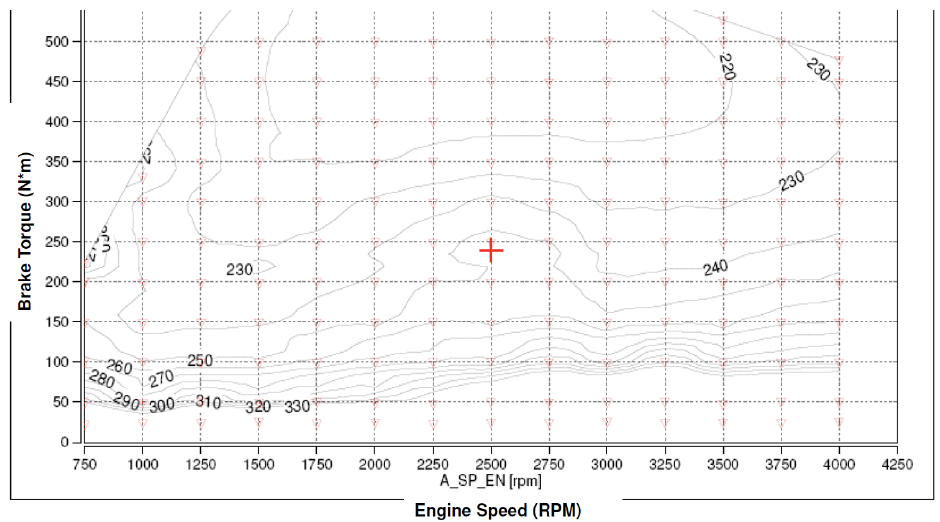

## Coursework Assignment 3: Investigating Engine Emissions

One of the range of diesel powered JLR cars is currently under review of new European emissions requirements.  PD management is interested to know the capability of the technology to support further reduction in NOx emissions without influencing other regulated emissions (particularly PM and PN) and fuel economy more than 1% BSFC. The challenge is high load conditions (across the speed range) which engineering management believes can be improved. Drivability meets all the JLR requirements and must be maintained through any of the proposed changes.

You have been asked to specify a project and to make estimates of engineer time to complete a study where the scope for improvement will be examined in detail.  Some changes to the control strategy could be considered. They include:

- Fuel rail pressure strategy.
- The use of a modified pulse pattern in fuel injection.
- The addition of an SCR emissions reduction system.

All of these technology choices are available and proven, your task is to assess the calibration implications. All will come at a cost and the priority order for those items needs to be understood. The engine is of a normal JLR configuration with high pressure common rail (HPCR), a variable geometry turbocharger (VGT), cooled EGR, piezo injectors and the recently added eTurbo. The steps of the project are as follows:

- Draft a set of project objectives.
- From an understanding of the engine’s current performance, identify a range of possible explanations of the weaknesses and how they could be compensated (taking into account the full range of influencing parameters).
- Set out an experiment plan (using DOE principles) to explore the current engine in its as-received condition and investigate the trade off between fuel consumption and NOx emissions in response to the controllable variables.
- Devise a new experiment plan to identify the contribution that can be made by the new, proposed controls.
- Identify the particular calibration issues that are raised by the use of SCR.
- Consider the experimental methods that you will need to use to explore the throttle response for the purposes of driveability assessment.  How will you select the most influential parameters?  How will you formulate an optimisation process and then extract the strategy?
- Draw all of the strands of the work together.  Consider the risks inherent in the experiment plan – both technical and timescale and how you will take steps to mitigate the risks.
- Estimate the person and test-bed time you will need and try to answer the question; is that use of resources reasonable?

You will draft a report addressed to your Chief Engineer that sets out a plan and identifies budget numbers for the required engineering effort and test bed time. The report should consist of the following main sections:

- An introduction explaining the background to the project.
- A summary of the approach that you will adopt.
- An analysis of the behaviour of the existing engine (using the supplied data) and a reasoned explanation of the current engine behaviour.
- A qualitative analysis of the control features and a comment on their likely effect and whether any other new control features should be considered.
- An overview of the experiment plan that you will follow to identify the relative significance of the new controlled variables
- The choice of experiment plan to place the new controls in a priority order and how that experiment design would be applied in practice.
- A description of the optimisation process you will follow once you have completed the experimental work on the engine.
- A description of the calibration and validation work that is needed to complete the transient calibration.
- A recommendation as to how to proceed including an analysis of technical risk, how that risk might be mitigated, and the resources required to complete the work.
  
The report should be no more than 10 pages in length and must include an executive summary on the first page.

## Additional Information

The following data has been provided by JLR to help set the context for the exercise.  Please bear in mind that this is a small fraction of the data typically generated during a calibration exercise.  

### Overall BSFC and BSNOx for a production engine

### An EGR sweep at a single speed load point

### Data illustrating SCR performance

