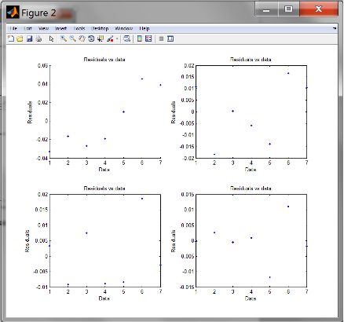
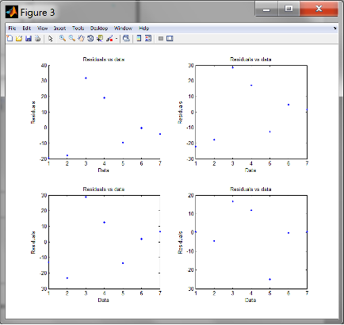
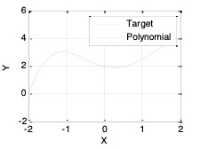

# Lab 3: Modelling Principles

{: .no_toc }

<details close markdown="block">
  <summary>
    Table of contents
  </summary>
  {: .text-delta }
1. TOC
{:toc}
</details>

## Topics

{: .no_toc }

- Aims and Objectives
- Overview of Exercise
- Exercise 3: Modelling Principles

## Learning Outcomes

{: .no_toc }

By the end of this lesson, you will be able to:

- Identify correlations between data streams
- Apply regression methods to engine data
- Fit a surface that describes the data and allows evaluation
- Fit time series response data with radial basis functions

## Aims and Objectives

The aim of this exercise is to investigate the creation of different forms of models. A few common types of model will be discussed and investigated notably polynomial and radial basis functions (RBF’s).

## Overview of Exercise

Once data has been acquired during a powertrain system test the first step in handling the data is the creation of a model. The reason for developing a model is to;

- Allow ready access to the data since it is now represented in a functional form;  
- Allow interpolation; the tests are conducted at discrete points and for the calibration process, data must be available at all possible values of the controlled parameters of the engine.

There are many forms of model and in this workshop we will consider just a few of the more commonly used types, notably polynomial and radial basis function (RBF) models.  We will also take a look at a very simple method useful in searching for relationships between data streams called cross-correlation.

The exercises consist of the following:

- Linear correlation – is there a relationship between two streams of data?
- Applying regression methods to engine data
- Fitting a surface that describes data and allows the data to be evaluated
- Fitting time response data using radial basis functions.

Files required for this modelling workshop can be downloaded [here](https://lunet-my.sharepoint.com/:u:/g/personal/ttbm2_lunet_lboro_ac_uk/EalgEOsYMElDgBgllbNGU8cB6Y0g3bPsMjW6L_fb_WQQBA?e=eFI01o) or on LEARN, they are;

- RBF_manualtune_V3_exercise.m
- V8NA_model_lab_TestBedData.csv

The test data is provided in the form of a spreadsheet, generated during tests of a V8 DI spark ignition engine, the test data are saved in the file V8NA_model_lab_TestBedData.csv.

You can load the data into MATLAB&copy; using the import button on the MATLAB&copy; toolstrip.  After this you may use the construct: ``<mydata = data(:,n)>`` to extract the nth column.

### Exercise 3: Modelling Principles

There are five tasks comprising this lesson:

- Task 3-1: Testing ``<xcorr>``
- Task 3-2: Sorting and filtering data
- Task 3-3: Fitting and error evaluation
- Task 3-4: Creating a surface plot
- Task 3-5: Tuning a system of RBFs

---

#### Task 3-1: Using ``<xcorr>`` to find correlations between data

Try the ``<xcorr>`` function using the following example:

```matlab
x = 0:0.01:10;
X = sin(x); 
Y = cos(x); 
[r,lags] = xcorr(X, 'coeff'); 
plot(lags, r)
```

Import the data in the file V8NA_model_lab_TestVedData.csv using the [Import Data] on the MATLAB&copy; toolstrip.  Be sure to import the data as a Numeric Matrix by changing the [Output Type] on the MATLAB&copy; toolstrip.

Evaluate correlations that may exist between the following pairs of data streams in the data file.  In each case think about the physical significance of the result.

- AFR (column 9) and exhaust temperature (column 11)
- Exhaust temperature (column 11) and BMEP (column 13)

Use the function ``<detrend>`` to remove the mean value of the data before running the ``<xcorr>`` function.  Why is this necessary?

---

#### Task 3-2: Importing and filtering the data

In this task you will be creating a functions that imports and filters data from the V8NA_model_lab_TestVedData.csv data file and files similar to it.  

Create a function named ``<import_and_filter(filename)>`` that does the following;

- Imports the data from the V8NA_model_lab_TestVedData.csv file

You may want to make use of the following code snippet in doing this;

```matlab
mydata = csvread(filename, 2, 0, [2, 0, 1050, 14]);
```

- Extracts data from the data rows with speed = 3500 rpm (column 2), relative load (column 3) 50-57% and removes data with BMEP_mean (column 13) < 6.79.

You may want to use code similar to the following when filtering your data;

```matlab
%Filter data
mydata(mydata(:,2)<3500,:)=[];
```

---

#### Task 3-3: Fitting and Error Evaluation

Create a function ``<model_fitting(xdata, ydata, r)>`` that fits a polynomial model of order n, using the MATLAB&copy; function ``<polyfit>``.  The function should be capable of importing input-output data of the form previously exported from the ``<import_and_filter>`` function developed in the previous exercise.  For the specified input-ouput data the order of the model should be iteratively increased until the fit statistic meets the requirement, in this case an $R^2$ value of 0.95.  The measure of fit should be passed as a third argument to the function.

The function should start by fitting a model order of 2 and incrementing this until the $R^2$ value exceeds the value of r. Once a sufficient model has been identified your function should plot the resulting function and the data points used to generate it.  On a separate plot the function should also plot the residuals i.e. the difference between the model and data points.  For each of the plots remember to include a title including the model order and axis labels.

As an example you should pass the following input-output data to your function (in two separate function calls) checking to ensure that required plots are generated;

- BMEP (column 13) [y] and ignition timing (column 6) [x]
- Exhaust temperature (column 11) [y] and AFR (column 9) [x]

To complete this task you may want to design your function along lines of the following;

1. Pass the input-output data and the fitness measure to the function.

2. Identify the polynomial model starting at order n = 2

The model can be identified using the MATLAB&copy; ``<polyfit>`` function, for example.  

```matlab
model_parameters = polyfit(input_data, output_data, n);
```

3. Evaluate the fit statistic

Once the model has been identified evaluate the fit statistics. If the fit requirements are met i.e. $R^2$ > 0.95 then move to the next step.  If the model fit does not meet the requirement, increment n and repeat step 2.

4. Plot the models and residuals on two different figures

Plot the model using ``<polyval>`` and ``<plot>``.  Remember to add a title and axis labels.  Also plot the residuals for each of the models






---

#### Task 3-4: Creating a Surface Plot

In this exercise, you will create a surface plot using the example data using poly(cfit) function.

The objective is to identify for each (speed, load) pair, the minimum exhaust temperature, then to plot the data as a surface.  Please check the notes in the Appendix for assistance with the usage of surface fitting functions.

Use the following code to get started:

```matlab
SPEED = mydata(:,2);
LOAD_CMD = mydata(:,14);
LOAD = mydata(:,13);
EXTEMP = mydata(:,11);

SL = unique([SPEED, LOAD_CMD], 'rows');
nRuns = size(SL, 1);

maxEXTEMP = zeros(nRuns, 1);
Load = zeros(nRuns, 1);
Speed = zeros(nRuns, 1);

for i = 1:nRuns
    idx = SPEED == SL(i,1) & LOAD_CMD == SL(i,2);
    maxEXTEMP(i) = max(EXTEMP(idx));
    Load(i) = mean(LOAD(idx));
    Speed(i) = mean(SPEED(idx));
end
```

Use the fit command to plot the surface.

```matlab
f1 = fit([Speed, Load], maxEXTEMP, 'Lowess', 'Normalize', 'on');
```

Note that ``<fit>`` returns an object of type fit that will be used by the plot function to plot the surface. “Lowess” indicates the use of a local regression fit.

Now, try constraining the fitting process by excluding some data. Use the following code:

```matlab
out = excludedata(Speed, maxEXTEMP, 'Range', [400, 700]);
f2 = fit([Speed, Load], maxEXTEMP, 'Lowess', 'Normalise', 'on', 'Exclude', out);
```

Please check the manual entry for fit for a listing of the other model types.  Try a polynomial and cubic surface and explain the similarities and differences.

---

#### Task 3-5: Tuning a System of RBF’s

In this exercise you will tune a system of Gaussian radial basis functions to represent a complex function between two variables.
A function, $$y=-0.25x^4+0.42x^3+x^2-0.67x+2$$, is to be modelled using Gaussian radial basis functions. The function is to be represented by five individual functions, you must tune each of the width, the centres and the weights in order to get a good fit to the function.  We will give you the function as the m-file, RBF_manualtune_V3_exercise.m in “TAS 2017>>3. Modelling lab” folder.


Note that in practice you would fit the RBFs to data.  We have given you a function to make the exercise straightforward to complete. At the end of the workshop we will distribute a model answer.

Then, use the MATLAB&copy; function ``<newrb`` to fit the RBF, ``<newrb>`` returns a function that can be used to evaluate the function.  Simply use that function with the input values to generate the outputs. See coding below:

```matlab
%RBF configurations and targets
err = 0.02; %RMSE target
wd = 1;     %RBF widths
n = 5;      %No of centers

%RBF network
net = newrb(x,T,Err,wd,n);
Y=net(x)
```

Next, plot the results to compare between target function and optimized RBF.



With an interaction level of 1, there are no terms in the model involving more than one factor. For example, for a four-factor cubic, for factor $$L$$, you see the terms for $$L$$, $$L^2$$, and $$^3$$, but no terms involving $$L$$ and other factors. In other words, there are no cross-terms included.

If you increase the interaction level to 2, under second-order terms you see $$L^2$$ and also $$L$$ multiplied by each of the other factors; that is, second-order cross-terms (for example, $$LN$$, $$LA$$, and $$LS$$).

Increase the interaction to 3, and under third-order terms you see $$L^2$$ multiplied by each of the other factors ($$L^2A$$, $$L^2N$$, $$L^2S$$), $$L$$ multiplied by other pairs of factors ($$LNA$$, $$LNS$$, $$LAS$$), and $$L$$ multiplied by each of the other factors squared ($$LN^2$$,$$LA^2$$, $$LN^2$$). Interaction level 3 includes all third-order cross-terms.
