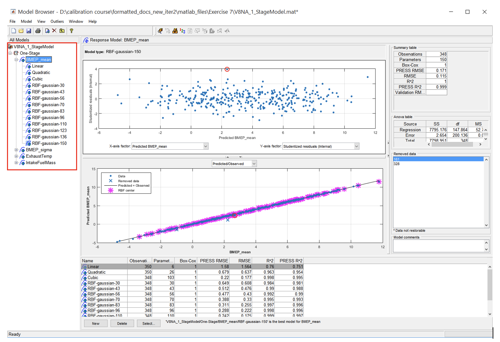

# Lab 7: MBC Based PI Controller Calibration
{: .no_toc }

  

    Table of contents
  

  {: .text-delta }
1. TOC
{:toc}

## Topics
{: .no_toc }

- Aims and Objectives
- Overview of Exercise
- Background Information
- Exercise 7: Optimisation Calibration for a V8 Engine (via RBF Modelling)

## Learning Outcomes
{: .no_toc }

By the end of this lesson, you will be able to:

- Fit an RBF model to represent engine behaviour
- Compare the quality of different types of models

## Aims and Objectives

The aim of this exercise is to compare the quality of polynomial and RBF models.

You have already met RBF techniques earlier in the module.  In this exercise you will fit and use an RBF model in place of a polynomial model, prior to using the model to support the generation of an engine calibration using the CAGE tool.  You will be looking for any differences in the accuracy of the model and its ability to support the optimisation process.

## Background Information

You met both types of model in the Modelling Workshop. A polynomial model is simply made up of terms that are multiples of the independent or control variables.  The ideal model is simple in form so that it can be interpolated quickly, accurately models the data and is capable of being generalised. For some engine phenomena a polynomial model meets these sometimes conflicting goals. However for other engine functions a polynomial is simply unable to represent the behaviour of the data and a different technique is needed.  Very often a radial basis function (RBF) is deployed. RBF techniques have been developed for other applications, and notably computer graphics, where the model if the behaviour of an image needs to be processed quickly.  The RBF can be used to represent the sometimes complex relationships in a way that is quickly computed.

---

## Exercise 7: Feature Calibration for a V8 Engine (Radial Basis Functions)

In this exercise there is one task, to build RBF models.

---

### Task 7-1: Build models

- Use “Build models” tool to add RBF models to your current response model. Generate RBF models with centres ranging from 30 to 350 with 10 models linearly spaced (as in figure below). Use linspace function when defining the centres of the RBF model

Save the project when finished and repeat the same optimization process from the previous Calibration Lab exercise.

- Observe the model quality between the polynomial models and RBF models. If polynomial model is the better model, discuss why this could be the case? When is polynomial model superior to RBF models?
- Compare the calibration maps between the one you produced in the previous lab and the one generated in this exercise. Take note of any changes to the form of the calibration data. Explain what you observe.

---
